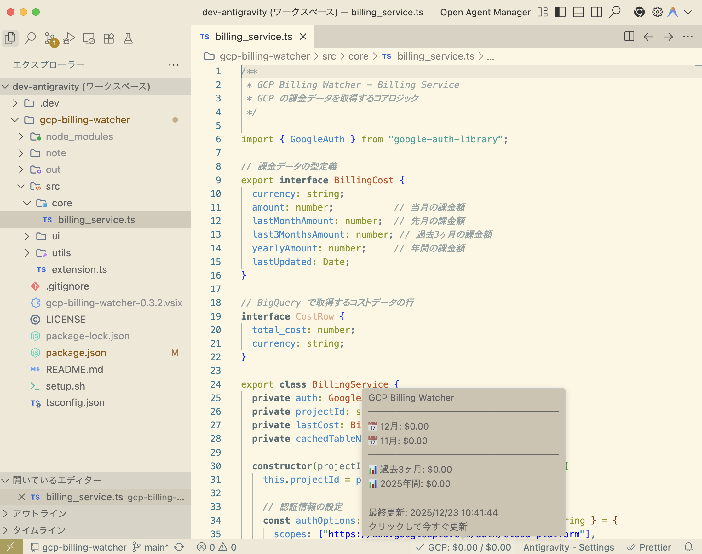

# GCP Billing Watcher

VS Code のステータスバーに GCP の課金状況（当月・先月・過去3ヶ月・年間）を表示する拡張機能です。



## 機能

- 📊 当月・先月・過去3ヶ月・年間の GCP 利用料金を表示
- 🔄 設定可能な間隔で自動更新（デフォルト 30 分）
- 🔐 Application Default Credentials に対応
- 🔍 BigQuery テーブル名を自動発見

### ステータスバー表示

```
✓ GCP: $12.34 / $156.78
       ~~~~~~   ~~~~~~~
       今月     年間
```

- **左側**: 今月の課金額
- **右側**: 年間の課金額（累計）
- ツールチップにホバーすると、先月・過去3ヶ月の詳細も確認できます

> ⚠️ **過去データについて**: Cloud Billing Export は **有効化した時点からのデータのみ** をエクスポートします。
> 過去のデータ（先月・過去3ヶ月・昨年分など）は遡って取得できません。
> 過去のデータが必要な場合は、[GCP コンソールの請求レポート](https://console.cloud.google.com/billing/reports) で直接確認してください。

---

## 前提条件

### 1. Google Cloud SDK のインストール

```bash
# Mac（Homebrew）
brew install --cask google-cloud-sdk

# または公式インストーラー
# https://cloud.google.com/sdk/docs/install

# インストール確認
gcloud --version
```

### 2. 認証の設定

```bash
# GCP にログイン
gcloud auth login

# Application Default Credentials を設定（拡張機能が使用）
gcloud auth application-default login

# プロジェクトを設定
gcloud config set project <your-project-id>
```

### 3. 必要な API の有効化

```bash
gcloud services enable bigquery.googleapis.com cloudbilling.googleapis.com --project=<your-project-id>
```

> 💡 課金の有効化は [GCP コンソール](https://console.cloud.google.com/billing) で行ってください。

---

## セットアップ手順

### Step 1: 認証とデータセットの作成

```bash
# リポジトリをクローン（または VSIX ファイルをダウンロード）
git clone https://github.com/kkitase/gcp-billing-watcher.git
cd gcp-billing-watcher

# セットアップスクリプトを実行
./setup.sh <project-id> [dataset-name] [location]

# 例）東京リージョンにデータセットを作成
./setup.sh my-project billing_export asia-northeast1
```

このスクリプトは以下を自動で行います：
- ✅ gcloud CLI の確認
- ✅ 認証状態の確認（未設定なら `gcloud auth application-default login` を促す）
- ✅ BigQuery データセット `billing_export` の作成

---

### Step 2: GCP コンソールで課金エクスポートを有効化

> ⚠️ この手順のみ、GCP コンソールでの手動操作が必要です。

1. [請求データのエクスポート](https://console.cloud.google.com/billing/export) にアクセス
2. 左メニューで対象の **請求先アカウント** を選択
3. **「標準の使用料金」** セクションの **「設定を編集」** をクリック
4. 以下を設定：
   - **プロジェクト**: Step 1 で指定したプロジェクトを選択
   - **データセット**: `billing_export` を選択
5. **「保存」** をクリック

> 📝 **重要**: エクスポート開始後、**初回データが蓄積されるまで 24〜48 時間** かかることがあります。
> テーブルは数分〜数時間で作成されますが、データが入るまで時間がかかります。


---

### Step 3: VS Code に拡張機能をインストール

1. [GitHub Releases](https://github.com/kkitase/gcp-billing-watcher/releases) から最新の `.vsix` ファイルをダウンロード
2. VS Code で `Cmd + Shift + P`（Mac）または `Ctrl + Shift + P`（Windows）
3. **「Extensions: Install from VSIX...」** を入力して選択
4. ダウンロードした `gcp-billing-watcher-x.x.x.vsix` を選択
5. **VS Code を再起動**

---

### Step 4: プロジェクト ID の設定

拡張機能の初回起動時、設定ダイアログが自動で表示されます。

1. **「今すぐ設定」** をクリック
2. プロジェクト ID（例: `my-project`）を入力

手動で設定する場合：
- VS Code 設定（`Cmd + ,`）→ 検索「gcpBilling」→ `Project Id` を入力

---

## 設定項目

| 設定 | 説明 | デフォルト |
|------|------|-----------|
| `gcpBilling.projectId` | 監視対象の GCP プロジェクト ID | (必須) |
| `gcpBilling.refreshIntervalMinutes` | 更新間隔（分） | 30 |

---

## 動作確認

セットアップ完了後、データが蓄積されるまでの状態遷移：

| 状態 | ステータスバー表示 | 説明 |
|------|-------------------|------|
| テーブル未作成 | `GCP: Error` | Step 2 の設定待ち |
| テーブル作成済み・データなし | `GCP: $0.00` | データ蓄積待ち（24〜48時間） |
| 正常動作 | `GCP: $XX.XX` | 当月の課金額を表示 |

---

## トラブルシューティング

### 「Error」または「404」が表示される

1. **課金エクスポートを設定したか確認**
   - [請求データのエクスポート](https://console.cloud.google.com/billing/export) で設定を確認

2. **テーブルが作成されているか確認**
   ```bash
   bq --project_id=<your-project> ls billing_export
   ```
   `gcp_billing_export_v1_XXXXXX` のようなテーブルが表示されれば OK

3. **認証を確認**
   ```bash
   gcloud auth application-default login
   ```

### $0.00 と表示される

正常です。課金エクスポートのデータが蓄積されるまで 24〜48 時間かかります。

### ステータスバーに表示されない

1. 拡張機能がインストールされているか確認（`Cmd + Shift + X` → 「GCP Billing」で検索）
2. VS Code を再起動
3. 出力パネル（`Cmd + Shift + U`）→ 「GCP Billing Watcher」を選択してログを確認

---

## 開発者向け

### ソースからビルド

```bash
git clone https://github.com/kkitase/gcp-billing-watcher.git
cd gcp-billing-watcher
npm install
npm run compile  # TypeScript コンパイル
npm run package  # VSIX パッケージ作成
```

### デバッグ

1. VS Code でこのプロジェクトを開く
2. `F5` キーで拡張機能開発ホストを起動

---

## 技術詳細

- **認証**: Google Auth Library（Application Default Credentials）
- **データ取得**: BigQuery REST API で課金エクスポートテーブルをクエリ
- **テーブル発見**: `billing_export` データセット内の `gcp_billing_export_v1_*` テーブルを自動検出

---

## 変更履歴

[CHANGELOG.md](CHANGELOG.md) を参照してください。

---

## ライセンス

MIT
