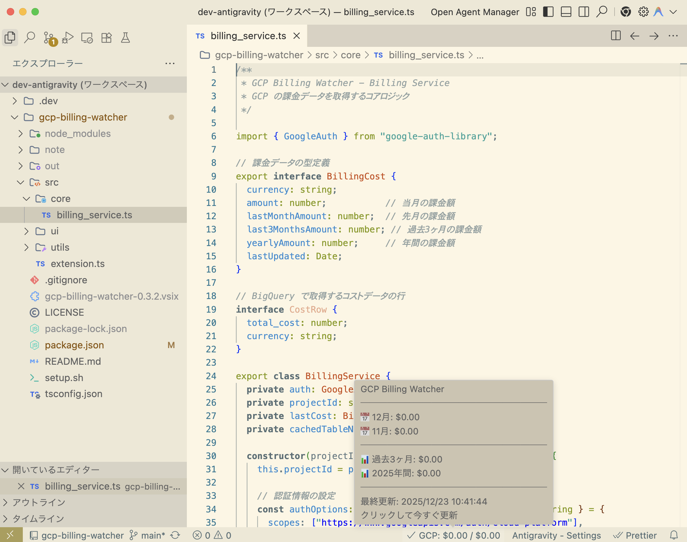

# Google Cloud Billing Watcher

VS Code のステータスバーに Google Cloud の課金状況（当月・年間など）をリアルタイムに表示する拡張機能です。



## セットアップ手順

マーケットプレイスからインストールした方は、以下の3つのステップを行うだけで使い始められます。

### Step 1: Google Cloud コンソールで課金エクスポートを有効化

1. [請求データのエクスポート](https://console.cloud.google.com/billing/export) にアクセスします。
2. 対象の **請求先アカウント** を選択します。
3. **「標準の使用料金」** セクション of **「設定を編集」** をクリックします。
4. 任意の **プロジェクト** と **データセット**（例: `billing_export`）を選択して保存します。
   - *注意: データセットがない場合は、BigQuery コンソールであらかじめ作成しておいてください。*

> 📝 **重要**: エクスポート開始後、**初回データが表示されるまで 24〜48 時間** かかることがあります。

### Step 2: 認証の設定（gcloud SDK）

拡張機能が Google Cloud にアクセスするために、お使いのマシンに `gcloud` CLI がインストールされ、認証されている必要があります。

```bash
# 1. ログイン
gcloud auth login

# 2. アプリケーション用認証の設定（必須）
gcloud auth application-default login

# 3. プロジェクトの設定
gcloud config set project <your-project-id>
```

### Step 3: VS Code でプロジェクトを設定

`settings.json` の `gcpBilling.projects` に1つ以上のプロジェクトを追加します：

```jsonc
{
  "gcpBilling.projects": [
    {
      "projectId": "your-project-id",
      "datasetId": "billing_export",
      "label": "メイン"
    }
  ]
}
```

| フィールド | 必須 | デフォルト | 説明 |
|---|---|---|---|
| `projectId` | ✅ | - | 課金エクスポート先の GCP プロジェクト ID |
| `datasetId` | | `billing_export` | BigQuery のデータセット名 |
| `credentialsPath` | | （ADC を使用） | サービスアカウント JSON のパス |
| `label` | | `projectId` | Tooltip 内訳に表示される名前 |

プロジェクト未設定で起動すると警告が表示され、「設定する」を押すと `gcloud projects list` から QuickPick で選択できます。

---

## 主な機能

- 📊 **ステータスバー表示**: 今月の課金額と年間の累計額を一目で確認。
- 💡 **ツールチップ詳細**: ホバーすると先月分や過去3ヶ月の履歴を表示。
- 💰 **予算アラート**: 予算を設定すると、使用量に応じてアイコンの色が変化。
- 🌐 **多言語対応**: 日本語と英語をサポート。設定から強制切り替えも可能。

---

## トラブルシューティング

### 「Google Cloud: Error」と表示される
- Google Cloud コンソールで「課金エクスポート」が正しく設定されているか確認してください。
- `gcloud auth application-default login` が完了しているか確認してください。
- 初回設定直後はデータが空のためエラーになることがあります。24時間ほどお待ちください。

### "unable to get issuer certificate" エラー（プロキシ環境）
- 企業プロキシなどで SSL 証明書のエラーが発生する場合、設定の `gcpBilling.skipSslVerification` を有効にしてください。※自己責任での使用をお願いします。

### 表示が $0.00 のまま
- 正常です。Google Cloud 側でデータが蓄積されるまで時間がかかります。

### コンソールのレポートと金額が一致しない
- **タイムラグ**: BigQuery へのエクスポートは 1 日に数回行われますが、**数時間〜最大24時間の遅延**があります。そのため、「今日」や「昨日」の数値はコンソールのリアルタイム表示よりも低くなることがあります。
- **有効化以前のデータ**: BigQuery には**エクスポートを有効にした日以降のデータ**のみが蓄積されます。月の途中で有効にした場合、その月の合計金額はコンソールよりも少なくなります。
- **集計対象の範囲**: 指定した BigQuery テーブルに保存されている**すべてのプロジェクトの費用**を合算して表示します。一部のプロジェクトが表示されない場合は、そのプロジェクトが同じ「請求先アカウント」に正しく紐付いているかを確認してください。

---

## 開発者・詳細設定

### 便利なセットアップスクリプト
リポジトリをクローンして使用する場合、`setup.sh` を使ってデータセットの作成などを自動化できます。
```bash
./setup.sh <project-id>
```

### VSIX からのインストール
[GitHub Releases](https://github.com/kkitase/gcp-billing-watcher/releases) から `.vsix` をダウンロードし、「Extensions: Install from VSIX...」でインストールできます。

### ビルド手順
```bash
git clone https://github.com/kkitase/gcp-billing-watcher.git
npm install
npm run compile
```

---

## ライセンス

MIT
